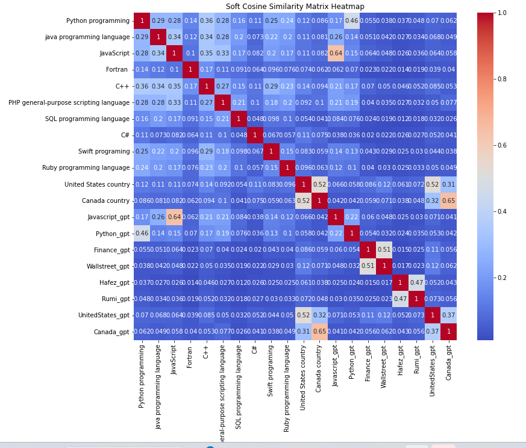

# Cosine Similarity and Soft Cosine Similarity Tutorial

A comprehensive tutorial on understanding and implementing Cosine Similarity and Soft Cosine Similarity using Python.



## Overview

This repository contains a Jupyter notebook that dives deep into the concepts of Cosine Similarity and Soft Cosine Similarity, two fundamental metrics in text analysis. Through this tutorial, users will learn how to compute, visualize, and interpret these similarities using Python.

## Contents

1. **Introduction to Cosine Similarity**: A foundational metric in text analysis.
2. **Data Preparation**: Steps to import text files and fetch content from Wikipedia.
3. **Visualization of Cosine Similarity**: Using heatmaps for an intuitive understanding.
4. **Deep Dive into Soft Cosine Similarity**: Incorporating semantic meaning for a nuanced comparison.
5. **Comparison and Analysis**: Observations and interpretations from the generated matrices.

## Prerequisites

- Basic knowledge of Python.
- Familiarity with Natural Language Processing (NLP) concepts.

## Dependencies

- Python 3.x
- Gensim
- Scikit-learn
- Wikipedia
- Seaborn
- Matplotlib

## Usage

1. Clone this repository.
2. Install the required dependencies.
3. Run the Jupyter notebook.

```bash
git clone https://github.com/rasnarim/CosineSimilarityTutorial.git
pip install -r requirements.txt
jupyter notebook
